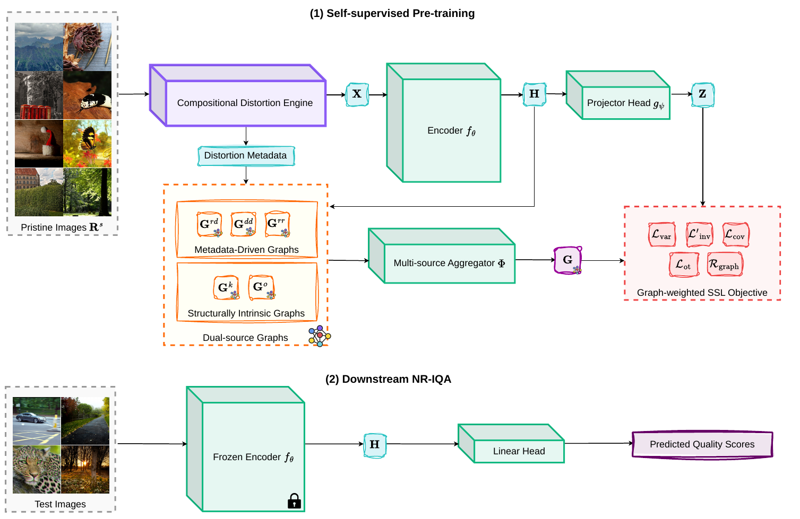

# SHAMISA

## SHAped Modeling of Implicit Structural Associations for Self-supervised No-Reference Image Quality Assessment

SHAMISA is a non-contrastive self-supervised framework for no-reference image quality assessment.

[Paper](https://arxiv.org/abs/2603.13669) | [Repository](https://github.com/Mahdi-Naseri/SHAMISA)

## Abstract

No-Reference Image Quality Assessment (NR-IQA) aims to estimate perceptual quality without access to a reference image of pristine quality. Learning an NR-IQA model faces a fundamental bottleneck: its need for a large number of costly human perceptual labels. We propose SHAMISA, a non-contrastive self-supervised framework that learns from unlabeled distorted images by leveraging explicitly structured relational supervision. Unlike prior methods that impose rigid, binary similarity constraints, SHAMISA introduces implicit structural associations, defined as soft, controllable relations that are both distortion-aware and content-sensitive, inferred from synthetic metadata and intrinsic feature structure. A key innovation is our compositional distortion engine, which generates an uncountable family of degradations from continuous parameter spaces, grouped so that only one distortion factor varies at a time. This enables fine-grained control over representational similarity during training: images with shared distortion patterns are pulled together in the embedding space, while severity variations produce structured, predictable shifts. We integrate these insights via dual-source relation graphs that encode both known degradation profiles and emergent structural affinities to guide the learning process throughout training. A convolutional encoder is trained under this supervision and then frozen for inference, with quality prediction performed by a linear regressor on its features. Extensive experiments on synthetic, authentic, and cross-dataset NR-IQA benchmarks demonstrate that SHAMISA achieves strong overall performance with improved cross-dataset generalization and robustness, all without human annotations or contrastive losses.

<p align="center">
  
</p>

## Setup

```bash
python -m venv .venv
source .venv/bin/activate
pip install -r requirements.txt
```

## Data Preparation

Download all datasets under a single `data_base_path` directory.

Dataset sources:

1. `LIVE`: download the Release 2 folder from `https://live.ece.utexas.edu/research/Quality/subjective.htm` and the `LIVE.txt` annotation file from `https://github.com/icbcbicc/IQA-Dataset/blob/master/csv/LIVE.txt`
2. `CSIQ`: download the source and distorted images from `https://s2.smu.edu/~eclarson/csiq.html` and the `CSIQ.txt` annotation file from `https://github.com/icbcbicc/IQA-Dataset/blob/master/csv/CSIQ.txt`
3. `TID2013`: download the official release from `https://www.ponomarenko.info/tid2013.htm`
4. `KADID10K`: download the official release from `http://database.mmsp-kn.de/kadid-10k-database.html`
5. `FLIVE`: download the dataset from `https://baidut.github.io/PaQ-2-PiQ/#download-zone`
6. `SPAQ`: download the dataset from `https://github.com/h4nwei/SPAQ`
7. `KADIS700`: for SHAMISA pretraining, place the pristine reference images extracted from the KADID-10K release under `KADIS700/ref_imgs`

The loaders expect the raw dataset files to be arranged as follows:

```text
data_base_path/
├── KADIS700/
│   └── ref_imgs/
├── LIVE/
│   ├── refimgs/
│   ├── jp2k/
│   ├── jpeg/
│   ├── wn/
│   ├── gblur/
│   ├── fastfading/
│   └── LIVE.txt
├── CSIQ/
│   ├── src_imgs/
│   ├── dst_imgs/
│   └── CSIQ.txt
├── TID2013/
│   ├── reference_images/
│   ├── distorted_images/
│   └── mos_with_names.txt
├── KADID10K/
│   ├── images/
│   └── dmos.csv
├── FLIVE/
│   ├── database/
│   └── labels_image.csv
└── SPAQ/
    ├── TestImage/
    └── Annotations/
```

After placing the raw datasets, generate the split files required by the evaluation loaders:

```bash
python scripts/data/prepare_splits.py --data-root /path/to/data_base_path
```

This creates the `splits/` folders used by SHAMISA:

```text
data_base_path/
├── LIVE/splits/
├── CSIQ/splits/
├── TID2013/splits/
├── KADID10K/splits/
├── FLIVE/splits/
└── SPAQ/splits/
```

The split generator creates reference-disjoint `70/10/20` train/val/test splits for LIVE, CSIQ, TID2013, and KADID10K, random `70/10/20` splits for SPAQ, and the FLIVE split bundle when the official split can be inferred from the dataset metadata.

## Training

Train the paper configuration:

```bash
python main.py --config configs/shamisa_a0.yaml --data_base_path /path/to/data_base_path --experiment_name shamisa_a0_reference
```

A training run writes checkpoints and resolved configs under `experiments/<experiment_name>/`.

## Evaluation

Evaluate the six NR-IQA benchmarks:

```bash
python test.py --config configs/shamisa_a0.yaml --data_base_path /path/to/data_base_path --experiment_name shamisa_a0_reference --eval_type scratch --model.method vicreg --test.fast_mode false --test.datasets live csiq tid2013 kadid10k flive spaq
```

Evaluate cross-dataset transfer:

```bash
python test.py --config configs/shamisa_a0.yaml --data_base_path /path/to/data_base_path --experiment_name shamisa_a0_reference --eval_type scratch --model.method vicreg --test.fast_mode false --test.cross_eval.enabled true --test.cross_eval.train_datasets live csiq tid2013 kadid10k --test.cross_eval.test_datasets live csiq tid2013 kadid10k
```

Evaluate the full-reference extension:

```bash
python test.py --config configs/shamisa_a0.yaml --data_base_path /path/to/data_base_path --experiment_name shamisa_a0_reference --eval_type scratch --model.method vicreg --fr_iqa --fr_sanity_checks --fr_sanity_samples 64 --plcc_logistic 1 --test.fast_mode false --test.datasets live csiq tid2013 kadid10k
```

## Paper Results

List the paper workflow entrypoints:

```bash
bash scripts/paper/reproduce.sh --help
bash scripts/paper/reproduce.sh --list
```

Run the main paper commands:

```bash
bash scripts/paper/reproduce.sh --data-root /path/to/data_base_path prepare-splits
bash scripts/paper/reproduce.sh --data-root /path/to/data_base_path --config configs/shamisa_a0.yaml --train-experiment shamisa_a0_reference train-a0
bash scripts/paper/reproduce.sh --data-root /path/to/data_base_path --config configs/shamisa_a0.yaml --train-experiment shamisa_a0_reference eval-main
bash scripts/paper/reproduce.sh --data-root /path/to/data_base_path --config configs/shamisa_a0.yaml --train-experiment shamisa_a0_reference eval-cross
bash scripts/paper/reproduce.sh --data-root /path/to/data_base_path --config configs/shamisa_a0.yaml --train-experiment shamisa_a0_reference eval-fr
bash scripts/paper/reproduce.sh --data-root /path/to/data_base_path --config configs/shamisa_a0.yaml ablations
bash scripts/paper/reproduce.sh --data-root /path/to/data_base_path --config configs/shamisa_a0.yaml --analysis-experiment shamisa_tsne tsne
bash scripts/paper/reproduce.sh --data-root /path/to/data_base_path --config configs/shamisa_a0.yaml --train-experiment shamisa_a0_reference umap
bash scripts/paper/reproduce.sh --data-root /path/to/data_base_path --config configs/shamisa_a0.yaml --train-experiment shamisa_a0_reference --comparison-experiment baseline_reference --waterloo-root /path/to/WaterlooExploration gmad
bash scripts/paper/reproduce.sh --data-root /path/to/data_base_path --config configs/shamisa_a0.yaml --dynamics-experiment shamisa_dynamics_a0 dynamics
bash scripts/paper/reproduce.sh --dynamics-experiment shamisa_dynamics_a0 plot-dynamics
```

Inspect the complete workflow without executing it:

```bash
bash scripts/paper/reproduce.sh --dry-run --data-root /path/to/data_base_path --waterloo-root /path/to/WaterlooExploration all
bash scripts/paper/run_ablations.sh --dry-run --data-root /path/to/data_base_path
```

## Tests

Run the focused unit tests:

```bash
python -m unittest discover -s tests -p 'test_*.py' -v
```

Run the README command smoke checks:

```bash
bash scripts/tests/run_readme_commands_smoke.sh
```

Run a short end-to-end smoke train/eval pass:

```bash
bash scripts/tests/run_smoke_a0.sh --data-root /path/to/data_base_path
```

## Acknowledgment

This repository is based on the ARNIQA source code and retains the required attribution and license terms.

## Citation

If you use SHAMISA in your research, please cite the paper:

```bibtex
@misc{naseri2026shamisashapedmodelingimplicit,
  title={SHAMISA: SHAped Modeling of Implicit Structural Associations for Self-supervised No-Reference Image Quality Assessment},
  author={Mahdi Naseri and Zhou Wang},
  year={2026},
  eprint={2603.13669},
  archivePrefix={arXiv},
  primaryClass={cs.CV},
  url={https://arxiv.org/abs/2603.13669}
}
```

## Contact

Mahdi Naseri  
Department of Electrical and Computer Engineering  
University of Waterloo  
mahdi.naseri@uwaterloo.ca
